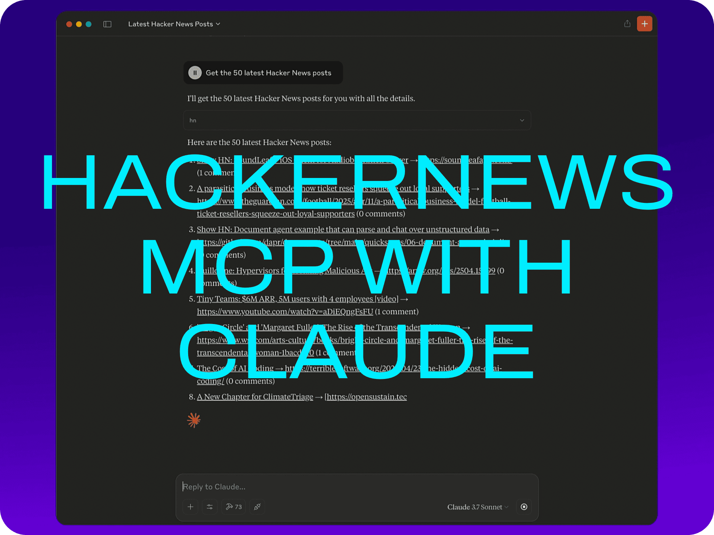

# MCP Claude Hacker News

[](https://smithery.ai/server/@imprvhub/mcp-claude-hackernews)

An integration that allows Claude Desktop to interact with Hacker News using the Model Context Protocol (MCP).

## Features

- Browse latest stories from Hacker News
- View top and best-rated stories
- Get story details
- Read comments for stories
- Clean formatting of Hacker News content for better readability

## Demo

<p>
  <a href="https://www.youtube.com/watch?v=SmPD6MLifJo">
    
  </a>
</p>

## Requirements

- Node.js 16 or higher
- Claude Desktop
- Internet connection to access Hacker News API

## Installation

### Installing Manually
1. Clone or download this repository:
```bash
git clone https://github.com/imprvhub/mcp-claude-hackernews
cd mcp-claude-hackernews
```

2. Install dependencies:
```bash
npm install
```

3. Build the project:
```bash
npm run build
```

## Running the MCP Server

There are two ways to run the MCP server:

### Option 1: Running manually

1. Open a terminal or command prompt
2. Navigate to the project directory
3. Run the server directly:

```bash
node build/index.js
```

Keep this terminal window open while using Claude Desktop. The server will run until you close the terminal.

### Option 2: Auto-starting with Claude Desktop (recommended for regular use)

The Claude Desktop can automatically start the MCP server when needed. To set this up:

#### Configuration

The Claude Desktop configuration file is located at:

- **macOS**: `~/Library/Application Support/Claude/claude_desktop_config.json`
- **Windows**: `%APPDATA%\Claude\claude_desktop_config.json`
- **Linux**: `~/.config/Claude/claude_desktop_config.json`

Edit this file to add the Hacker News MCP configuration. If the file doesn't exist, create it:

```json
{
  "mcpServers": {
    "hackerNews": {
      "command": "node",
      "args": ["ABSOLUTE_PATH_TO_DIRECTORY/mcp-claude-hackernews/build/index.js"]
    }
  }
}
```

**Important**: Replace `ABSOLUTE_PATH_TO_DIRECTORY` with the **complete absolute path** where you installed the MCP
  - macOS/Linux example: `/Users/username/mcp-claude-hackernews`
  - Windows example: `C:\\Users\\username\\mcp-claude-hackernews`

If you already have other MCPs configured, simply add the "hackerNews" section inside the "mcpServers" object. Here's an example of a configuration with multiple MCPs:

```json
{
  "mcpServers": {
    "otherMcp1": {
      "command": "...",
      "args": ["..."]
    },
    "otherMcp2": {
      "command": "...",
      "args": ["..."]
    },
    "hackerNews": {
      "command": "node",
      "args": [
        "ABSOLUTE_PATH_TO_DIRECTORY/mcp-claude-hackernews/build/index.js"
      ]
    }
  }
}
```

The MCP server will automatically start when Claude Desktop needs it, based on the configuration in your `claude_desktop_config.json` file.

## Usage

1. Restart Claude Desktop after modifying the configuration
2. In Claude, use the `hn` command to interact with Hacker News
3. The MCP server runs as a child process managed by Claude Desktop

## Available Commands

The Hacker News MCP provides a single tool named `hn` with several commands:

| Command | Description | Parameters | Example |
|---------|-------------|------------|---------|
| `latest` | Get the most recent stories from Hacker News | `param`: Optional number of stories (default: 10, max: 50) | `hn latest --50` |
| `top` | Get the top stories from Hacker News | `param`: Optional number of stories (default: 10, max: 50) | `hn top --20` |
| `best` | Get the best stories from Hacker News | `param`: Optional number of stories (default: 10, max: 50) | `hn best --30` |
| `history` | Get detailed information about a specific story | `param`: Required story ID | `hn history --12345678` |
| `comments` | Get comments for a story | `param`: Required index from last list or story ID | `hn comments --3` or `hn comments --12345678` |

## Example Usage

Here are various examples of how to use the Hacker News MCP with Claude:

### Direct Commands:

```
hn latest --50
hn top --20
hn best --30
hn history --29384756
hn comments --5
```

### Natural Language Queries:

You can also interact with the MCP using natural language. Claude will interpret these requests and use the appropriate commands:

- "Show me the top 30 stories on Hacker News today"
- "What are the 40 latest posts on Hacker News?"
- "I'd like to see the 20 best articles from Hacker News"
- "Can you fetch me 30 recent tech news stories from Hacker News?"
- "Tell me what's the top 50 trending topics on Hacker News"
- "Show me 20 Hacker News stories about machine learning"
- "Get me the 40 most recent Hacker News headlines"
- "What are the 30 most active discussions on Hacker News right now?"
- "I'm interested in reading the 40 most popular Hacker News articles this week"
- "Show me a list of 20 best programming articles from Hacker News"

### Language Translation Requests:

You can request Hacker News content to be translated into different languages:

- "Show me the top 30 stories on Hacker News today in Spanish"
- "Get the 20 latest Hacker News posts and translate them to French"
- "I'd like to see the 40 best articles from Hacker News in German"
- "Show me 30 recent Hacker News stories translated to Japanese"
- "Get the top 20 Hacker News articles and present them in Portuguese"

## Troubleshooting

### "Server disconnected" error
If you see the error "MCP Hacker News: Server disconnected" in Claude Desktop:

1. **Verify the server is running**:
   - Open a terminal and manually run `node build/index.js` from the project directory
   - If the server starts successfully, use Claude while keeping this terminal open

2. **Check your configuration**:
   - Ensure the absolute path in `claude_desktop_config.json` is correct for your system
   - Double-check that you've used double backslashes (`\\`) for Windows paths
   - Verify you're using the complete path from the root of your filesystem

3. **Try the auto-start option**:
   - Set up the auto-start script for your operating system as described in the "Setting up auto-start scripts" section
   - This ensures the server is always running when you need it

### Tools not appearing in Claude
If the Hacker News tools don't appear in Claude:
- Make sure you've restarted Claude Desktop after configuration
- Check the Claude Desktop logs for any MCP communication errors
- Ensure the MCP server process is running (run it manually to confirm)
- Verify that the MCP server is correctly registered in the Claude Desktop MCP registry

### Checking if the server is running
To check if the server is running:

- **Windows**: Open Task Manager, go to the "Details" tab, and look for "node.exe"
- **macOS/Linux**: Open Terminal and run `ps aux | grep node`

If you don't see the server running, start it manually or use the auto-start method.

## Contributing

Contributions are welcome! Please feel free to submit a Pull Request.

## License

This project is licensed under the Mozilla Public License 2.0 - see the [LICENSE](https://github.com/imprvhub/mcp-claude-hackernews/blob/main/LICENSE) file for details.

## Related Links

- [Model Context Protocol](https://modelcontextprotocol.io/)
- [Hacker News API](https://github.com/HackerNews/API)
- [Claude Desktop](https://claude.ai/download)